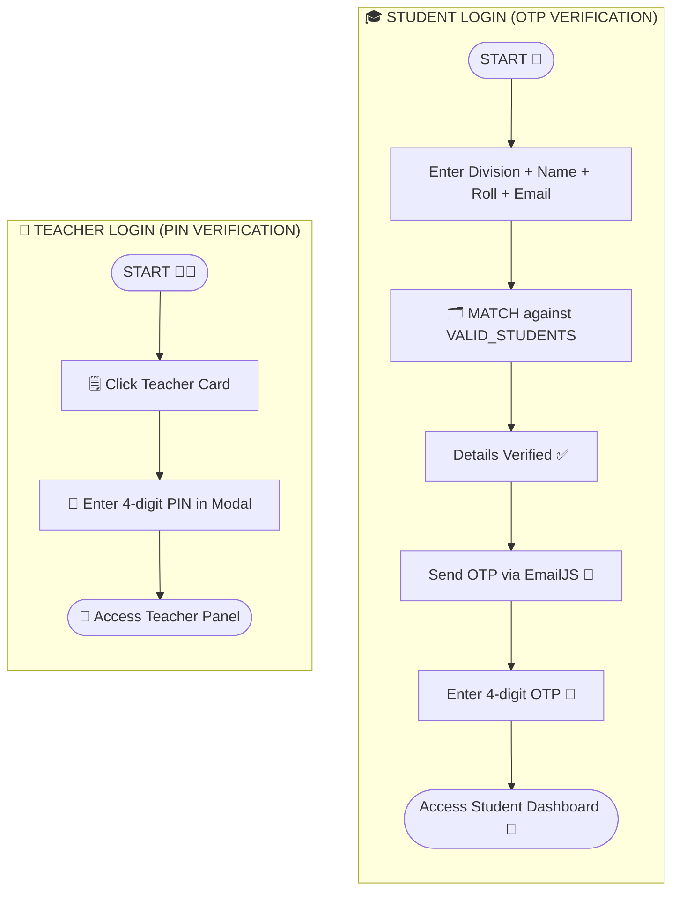

# 📚 AssignTrack — Classroom Assignment Manager

> A sleek, role-based assignment management web app for teachers and students — built with vanilla HTML, CSS & JavaScript.

---

## ✨ Features

### 🎓 Student Side
- **Secure OTP Login** — Students verify their identity using division, name, roll number, and registered email, followed by a 4-digit OTP sent via EmailJS
- **Assignment Dashboard** — View all assignments for your division with subject, due date, and submission status
- **Real-time Status Badges** — Instantly see which assignments are pending or submitted

### 🏫 Teacher Side
- **PIN-Protected Access** — Teachers log in via a secure 4-digit PIN modal
- **Create Assignments** — Set title, subject, description, due date, and target division
- **Submission Tracking** — View per-student submission status with a live progress bar
- **Manual Mark Done** — Toggle any student's submission status with a single click
- **Delete Assignments** — Remove assignments with a confirmation prompt

### 🎨 UI / UX
- Animated glassmorphism dark theme with drifting background orbs
- Smooth page transitions and card animations (`fadeUp`, `scaleIn`, `float`)
- Toast notification system (success / error / info)
- Fully responsive — works on mobile and desktop
- XSS-safe rendering via `escapeHTML` / `escapeAttr` helpers

---

## 🛠️ Tech Stack

| Layer | Technology |
|---|---|
| Markup | HTML5 |
| Styling | CSS3 (custom properties, animations, glassmorphism) |
| Logic | Vanilla JavaScript (ES6+) |
| Email / OTP | [EmailJS](https://www.emailjs.com/) |
| Fonts | [Syne](https://fonts.google.com/specimen/Syne) · [DM Mono](https://fonts.google.com/specimen/DM+Mono) |
| Storage | `localStorage` (client-side persistence) |

---

## 📁 Project Structure

```
EPD/
├── index.html      # App shell — all screens & modals
├── script.js       # All logic: auth, CRUD, rendering, EmailJS
└── style.css       # Full design system — variables, components, animations
```

---

## 🚀 Getting Started

### Prerequisites
- A modern web browser (Chrome, Firefox, Edge, Safari)
- An [EmailJS](https://www.emailjs.com/) account with a configured service and template
- No build tools or package managers needed

### 1. Clone the repository
```bash
git clone https://github.com/vedantpanhale1055-MH/EPD.git
cd EPD
```

### 2. Configure EmailJS

Open `script.js` and replace the placeholders with your own EmailJS credentials:

```js
// Initialize EmailJS
emailjs.init("YOUR_PUBLIC_KEY");

// Inside the send-OTP handler:
emailjs.send("YOUR_SERVICE_ID", "YOUR_TEMPLATE_ID", {
    to_name:  activeStudent.name,
    to_email: activeStudent.email,
    otp_code: generatedOTP
});
```

Your EmailJS template should accept three variables: `{{to_name}}`, `{{to_email}}`, and `{{otp_code}}`.

### 3. Add students to the roster

Edit the `VALID_STUDENTS` array in `script.js`:

```js
const VALID_STUDENTS = [
    { roll: "1", name: "Full Name", division: "1", email: "student@email.com" },
    // Add more students here...
];
```

### 4. Set the teacher PIN *(optional)*

```js
const TEACHER_PIN = "1234"; // Change to your preferred PIN
```

### 5. Open the app

Simply open `index.html` in a browser — no server required.

```bash
# macOS / Linux
open index.html

# Or just double-click index.html in your file explorer
```

---

## 🔐 Authentication Flow



---

## 📋 Usage

### As a Teacher
1. Click **Teacher** on the home screen
2. Enter the PIN (`1234` by default)
3. Fill in the **New Assignment** form and click **Create Assignment**
4. Click any assignment card to open the student submission list
5. Click **Mark Done** / **✓ Submitted** to toggle a student's status

### As a Student
1. Click **Student** on the home screen
2. Enter your Division, Full Name, Roll Number, and Registered Email
3. Click **Verify Details** → **Send OTP to Email**
4. Enter the 4-digit OTP received in your inbox
5. View all assignments and their submission status for your division

---

## ⚙️ Configuration Reference

| Constant | Location | Purpose |
|---|---|---|
| `VALID_STUDENTS` | `script.js` | Student roster for login verification |
| `TEACHER_PIN` | `script.js` | PIN for teacher access |
| `emailjs.init(...)` | `script.js` | Your EmailJS public key |
| `emailjs.send(...)` | `script.js` | Your EmailJS service & template IDs |
| Division options | `index.html` | `<select id="assign-division">` |

---

## 🗺️ Roadmap

- [ ] Backend integration (Node.js / Firebase) for persistent multi-device data
- [ ] Admin panel to manage the student roster dynamically
- [ ] File upload support for assignment submissions
- [ ] Email notifications to students when a new assignment is posted
- [ ] Dark / light theme toggle

---

## 🤝 Contributing

Contributions are welcome! Please follow these steps:

1. Fork the repository
2. Create a feature branch: `git checkout -b feature/your-feature-name`
3. Commit your changes: `git commit -m "feat: add your feature"`
4. Push to the branch: `git push origin feature/your-feature-name`
5. Open a Pull Request

---


---

## 👤 Author

**Vedant Panhale**
- GitHub: [@vedantpanhale1055-MH](https://github.com/vedantpanhale1055-MH)

---

> *Built with ❤️ for classroom management — keeping assignments organized, one division at a time.*
